# Capitall

Platforma do zarządzania kapitałem inwestycyjnym: portfel kryptowalut i akcji, automatyczne strategie (boty, DCA), analityka ryzyka, backtesting i raport podatkowy PIT-38. Wszystko w jednym panelu webowym z danymi rynkowymi na żywo.

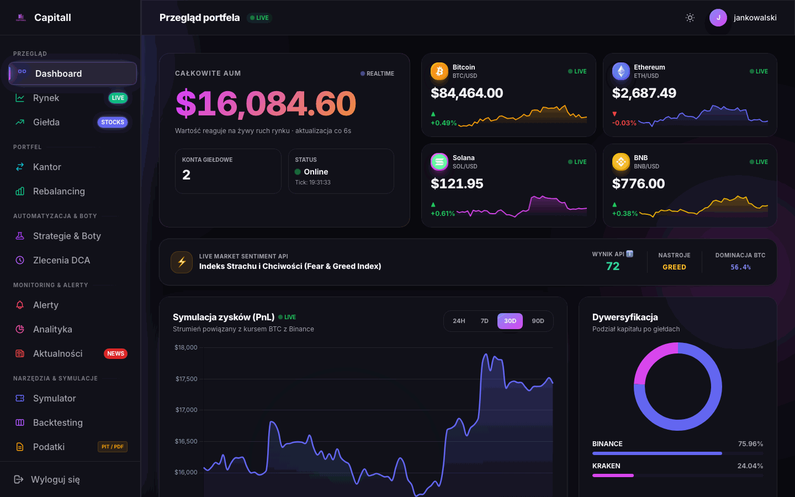

**Technologie:** Java 21 · Spring Boot 3.3 · Spring Security · Spring Data JPA · Thymeleaf · H2 / PostgreSQL · Tailwind CSS · Chart.js

---

## Spis treści

- [Funkcje w skrócie](#funkcje-w-skrócie)
- [Przewodnik po aplikacji (widok użytkownika)](#przewodnik-po-aplikacji-widok-użytkownika)
- [Bezpieczeństwo](#bezpieczeństwo)
- [Źródła danych](#źródła-danych)
- [Uruchomienie](#uruchomienie)
- [Konfiguracja](#konfiguracja)
- [Architektura](#architektura)

---

## Funkcje w skrócie

| Obszar | Co daje użytkownikowi |
|---|---|
| **Przegląd** | Dashboard z AUM w czasie rzeczywistym, kursami BTC/ETH/SOL/BNB, indeksem Fear & Greed i wykresem wartości portfela |
| **Rynek krypto** | Kupno/sprzedaż kryptowalut po kursach z Binance, pozycje z P&L na żywo, pełnoekranowy wykres z narzędziami rysowania |
| **Giełda** | Terminal akcji US i GPW (AAPL, NVDA, CDR, PKO…): wykres świecowy, SMA 20, order book, zlecenia market/limit |
| **Kantor** | Wymiana PLN/USD/EUR/GBP po kursach NBP, wirtualne wpłaty i wypłaty |
| **Rebalancing** | Ustalenie docelowych wag portfela i automatycznie wyliczony plan transakcji |
| **Strategie & Boty** | Kreator botów bez kodu: Smart Dip, DCA czasowe, RSI < 30, przecięcie średnich + trailing stop / take profit |
| **Zlecenia DCA** | Cykliczne zakupy za stałą kwotę co 1/7/14/30 dni, tryb Smart DCA (2× kwota przy spadku o 10%) |
| **Alerty** | Alerty cenowe dla krypto i akcji (powyżej/poniżej), jednorazowe lub cykliczne, z dziennikiem zdarzeń |
| **Analityka** | Sharpe ratio, maksymalne obsunięcie, beta względem BTC, VaR 95%, mapa ryzyko/zwrot |
| **Aktualności** | Kanał newsów z kategoriami, wyszukiwarką i trendującymi tagami |
| **Symulator** | Konto demo z wirtualnymi $10 000 do nauki handlu bez ryzyka |
| **Backtesting** | Test strategii SMA Crossover, RSI i Bollinger Bands na danych historycznych (1 mies. – 2 lata) |
| **Podatki** | Raport PIT-38 metodą FIFO/LIFO z przeliczeniem na PLN po kursach NBP i eksportem do CSV |
| **Ustawienia** | Zmiana hasła, prywatność portfela, eksport danych do CSV, status połączeń API, dziennik aktywności |

---

## Przewodnik po aplikacji (widok użytkownika)

Zrzuty ekranu pochodzą z konta zwykłego użytkownika (rola `USER`). Sekcje administracyjne (Aktywa, Alokacje, Administracja) nie są widoczne w menu użytkownika.

### Strona główna, logowanie i rejestracja

Publiczna strona startowa prezentuje produkt i obsługiwane giełdy. Nowy użytkownik zakłada konto (login, e-mail, telefon, silne hasło), potwierdza adres przez link aktywacyjny, a potem konfiguruje uwierzytelnianie dwuskładnikowe (TOTP) w aplikacji typu Google Authenticator.

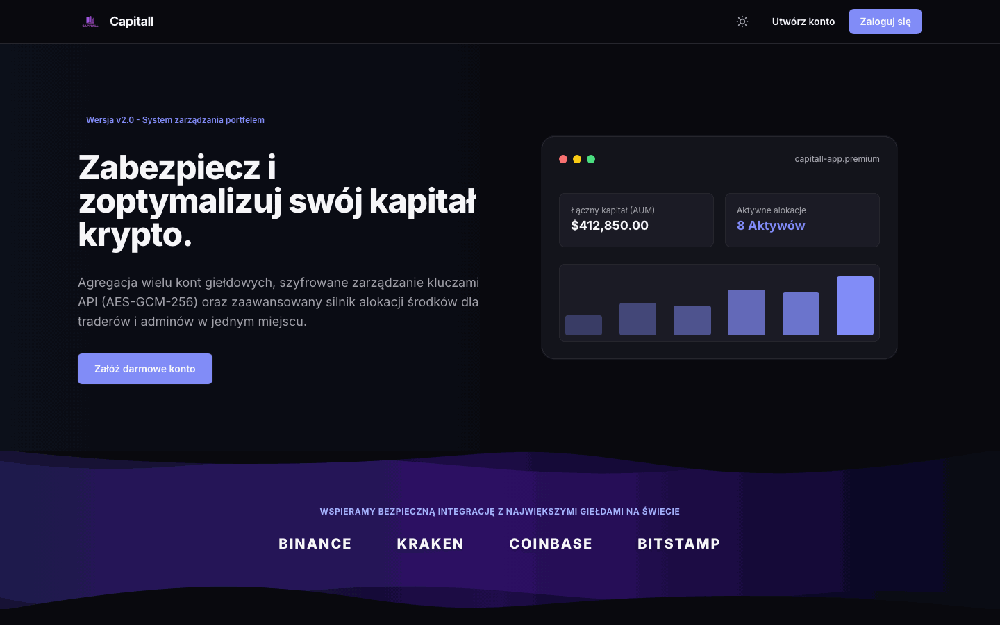

<p>
  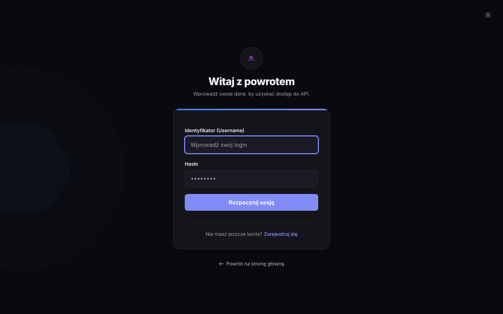
  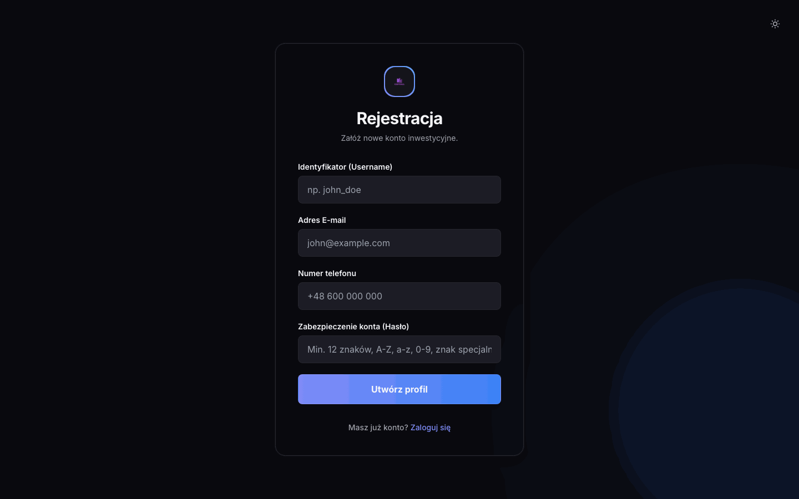
</p>

### Dashboard: przegląd portfela

- **Całkowite AUM**: wartość kapitału przypisanego do użytkownika, odświeżana co 6 s
- **Kafelki live** dla BTC, ETH, SOL i BNB ze sparkline'ami i zmianą 24h
- **Fear & Greed Index** oraz dominacja BTC na rynku
- **Wykres PnL** z zakresami 24h / 7D / 30D / 90D
- **Dywersyfikacja**: podział kapitału między konta giełdowe
- **Wartość portfela w czasie**: snapshoty co 5 minut i po każdej transakcji


### Rynek krypto

Lista najpopularniejszych kryptowalut z ceną, zmianą 24h i wolumenem (sortowanie po kapitalizacji, wzrostach lub spadkach). Kliknięcie kafelka otwiera pełnoekranowy wykres z narzędziami rysowania. W sekcji **Twoje pozycje** widać ilość, średni koszt, aktualną wartość i niezrealizowany P&L każdej pozycji, a w historii transakcji zrealizowany zysk lub stratę. Przycisk **Zasil portfel** dodaje środki USD.

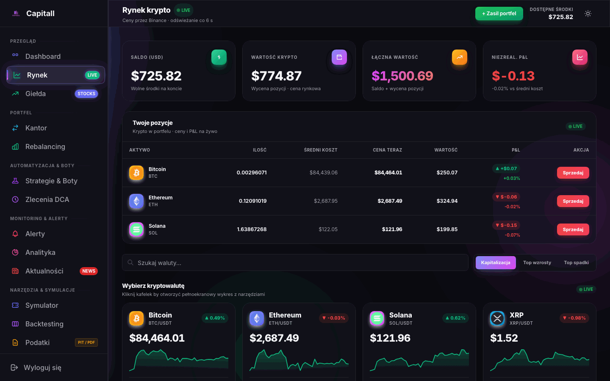

### Giełda papierów wartościowych

Terminal dla spółek amerykańskich (US Tech), GPW (CD Projekt, PKO BP, Orlen, KGHM, LPP, Dino, Allegro) i ETF-ów (SPY, QQQ). Ma pasek notowań, wykres świecowy/liniowy/obszarowy z SMA 20 i wolumenem, order book oraz formularz kupna i sprzedaży (market/limit, szybkie 25/50/75/100% salda). Posiadane akcje można sprzedać jednym kliknięciem.

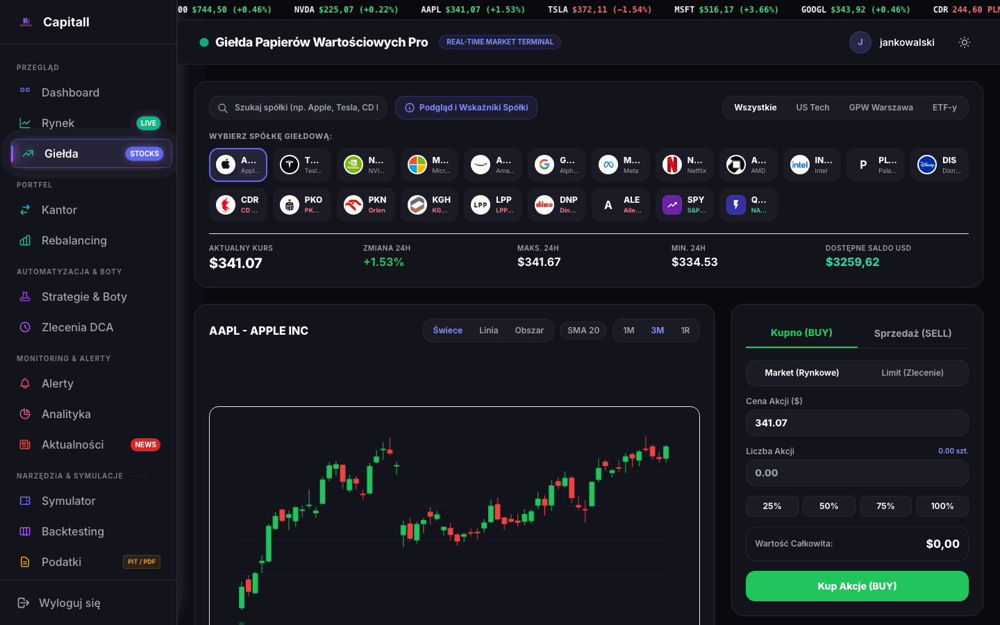

### Kantor walutowy

Wymiana między PLN, USD, EUR i GBP po kursach średnich NBP z 0,8% spreadem kantoru. Wirtualny terminal bankowy obsługuje wpłaty i wypłaty w wybranej walucie, a tabela kursów pokazuje kurs średni, kupna i sprzedaży.

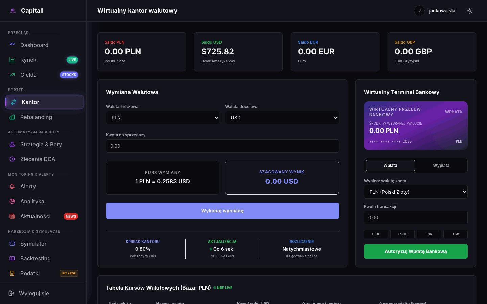

### Rebalancing portfela

Użytkownik ustawia docelowy udział aktywów (suma = 100%). Kalkulator pokazuje wskaźnik zgodności portfela z celem, analizę odchyleń dla każdego aktywa i gotowy plan zleceń kupna i sprzedaży potrzebnych do wyrównania portfela.

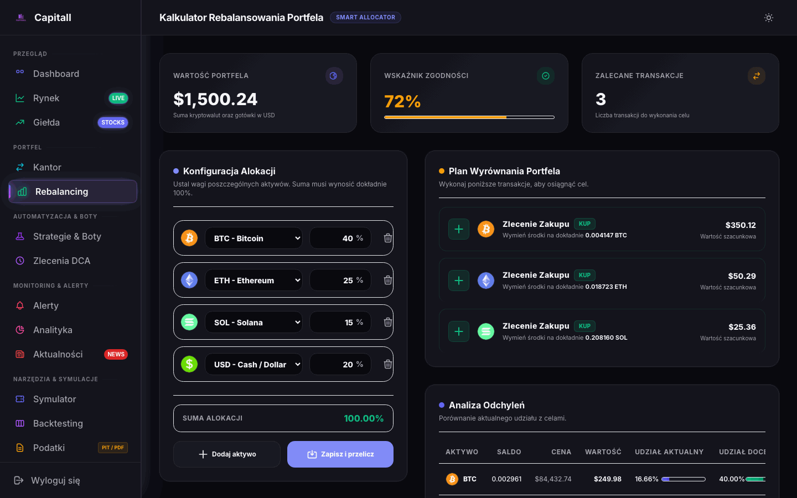

### Strategie i boty handlowe

Wizualny kreator botów bez pisania kodu:

- **Gotowe szablony**: NVIDIA AI Dip, BTC RSI Sniper, CD Projekt DCA, Tesla Scalper
- **Sygnał wejścia**: DCA czasowe, Smart Dip (kupno po spadku o X%), RSI < 30, przecięcie średnich kroczących
- **Zarządzanie ryzykiem**: trailing stop, take profit, stop loss
- **Podgląd przepływu** (node flow) i log silnika na żywo
- Statystyki botów (łączny PnL, win rate, liczba egzekucji), pauza/wznowienie, eksport strategii do JSON

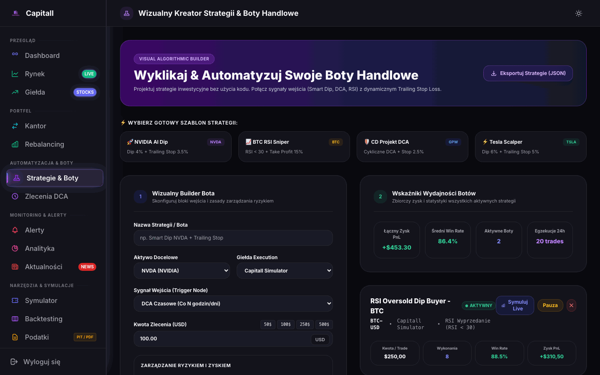

### Zlecenia cykliczne DCA

Plan DCA (Dollar-Cost Averaging) kupuje wybraną kryptowalutę za stałą kwotę co dzień, tydzień, dwa tygodnie lub miesiąc. Tryb **Smart DCA** podwaja kwotę zakupu, gdy cena spadnie o 10%. Panel pokazuje szacowany miesięczny koszt, saldo pozostałe po odjęciu planów i termin następnego zakupu. Harmonogram sprawdza zlecenia co 15 sekund.

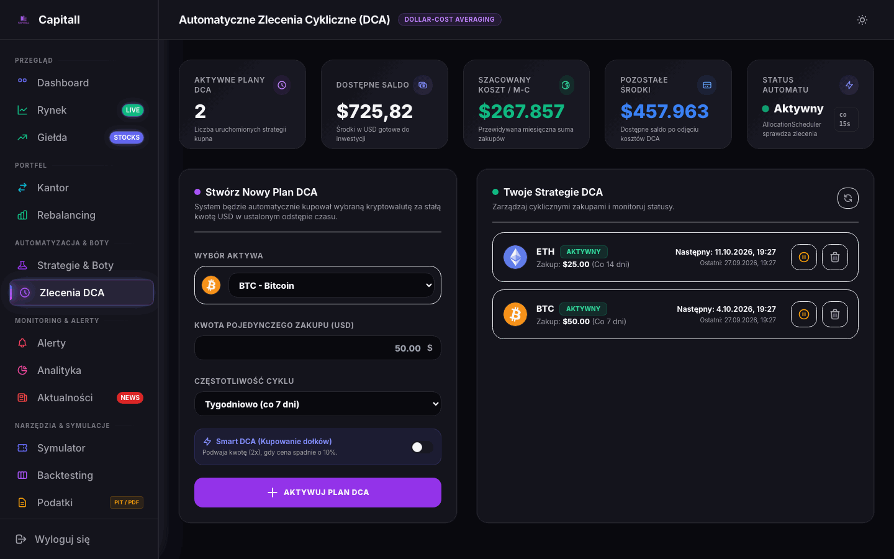

### Alerty cenowe

Alerty dla kryptowalut i akcji/ETF z warunkiem „powyżej” lub „poniżej” ceny docelowej, jednorazowe albo cykliczne (maks. jedno powiadomienie dziennie). Ceny są sprawdzane co 6 sekund, a po spełnieniu warunku pojawia się powiadomienie i wpis w dzienniku zdarzeń.

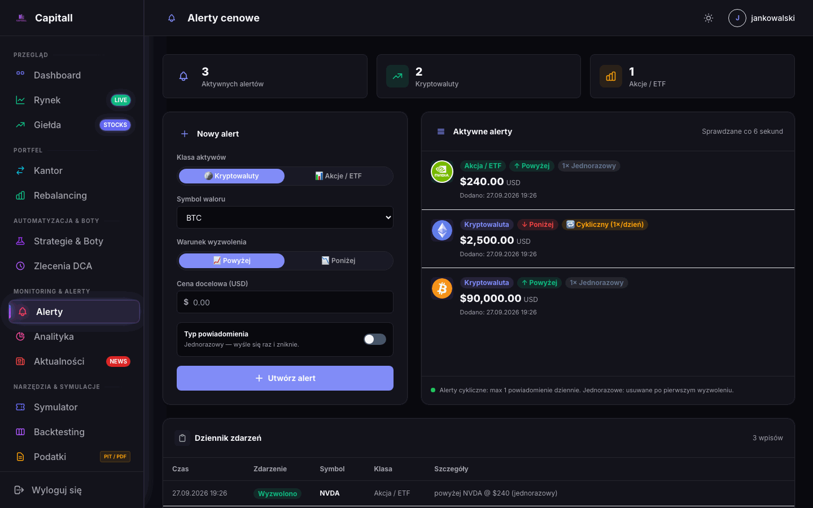

### Analityka portfela

Wskaźniki ryzyka liczone z historii portfela:

- **Sharpe ratio** (horyzont 30 dni, w ujęciu rocznym)
- **Maksymalne obsunięcie** (max drawdown)
- **Beta względem BTC**
- **Value at Risk 95%** (1-dniowy, historyczny)

Do tego struktura portfela i wykres pozycjonowania aktywów według zmienności i średniej stopy zwrotu.

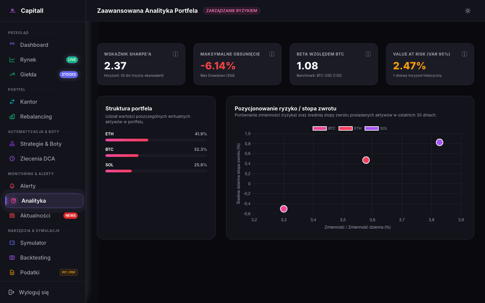

### Aktualności rynkowe

Kanał wiadomości z wyróżnionym artykułem, kategoriami (Giełda, Kryptowaluty, Gospodarka, Technologia), wyszukiwarką i trendującymi tagami. Artykuły otwierają się w czytniku wewnątrz aplikacji.

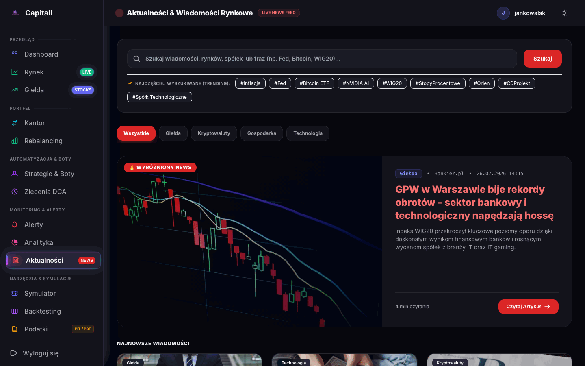

### Symulator (tryb demo)

Oddzielne konto demo z wirtualnymi $10 000 do ćwiczenia handlu na kryptowalutach, akcjach US, spółkach GPW i ETF-ach. Pokazuje wycenę portfela demo, PnL i ROI. Pozwala doładować konto wirtualnymi środkami, ustawić trailing stop na pozycji i zresetować portfel.

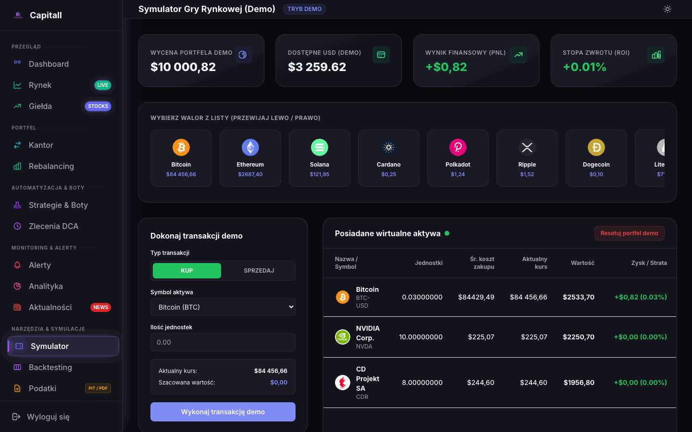

### Backtesting strategii

Test strategii na danych historycznych dla wybranego aktywa i okresu (1 miesiąc – 2 lata):

- **SMA Crossover** (konfigurowalne średnie krótka/długa)
- **RSI** (okres, poziomy wykupienia/wyprzedania)
- **Bollinger Bands** (okres, odchylenie standardowe)

Wynik zawiera kapitał końcowy, zwrot, max drawdown, Sharpe ratio, win rate, krzywą equity w porównaniu z Buy & Hold, wykres ceny z sygnałami i listę transakcji.

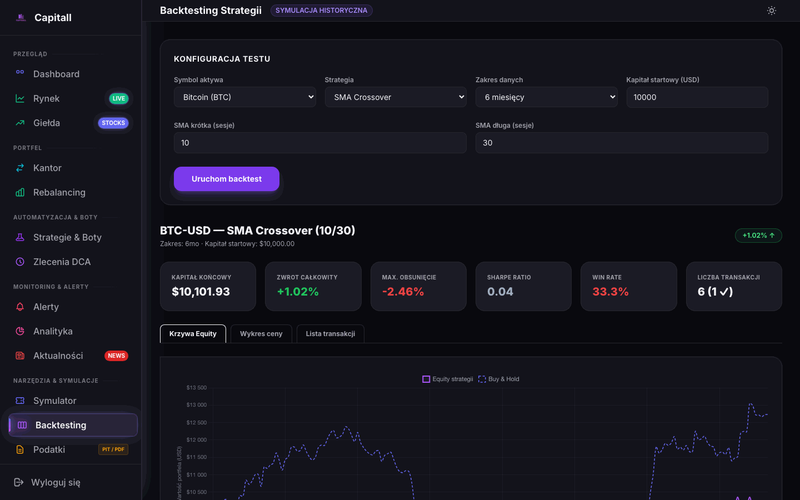

### Raport podatkowy PIT-38

Raport za wybrany rok podatkowy, liczony metodą **FIFO** lub **LIFO**. Każda sprzedaż jest parowana z zakupami, a kwoty w walutach obcych są przeliczane na PLN po kursach średnich NBP. Raport pokazuje przychód, koszty z prowizjami, dochód lub stratę i podatek 19%. Zestawienie można wyeksportować do CSV.

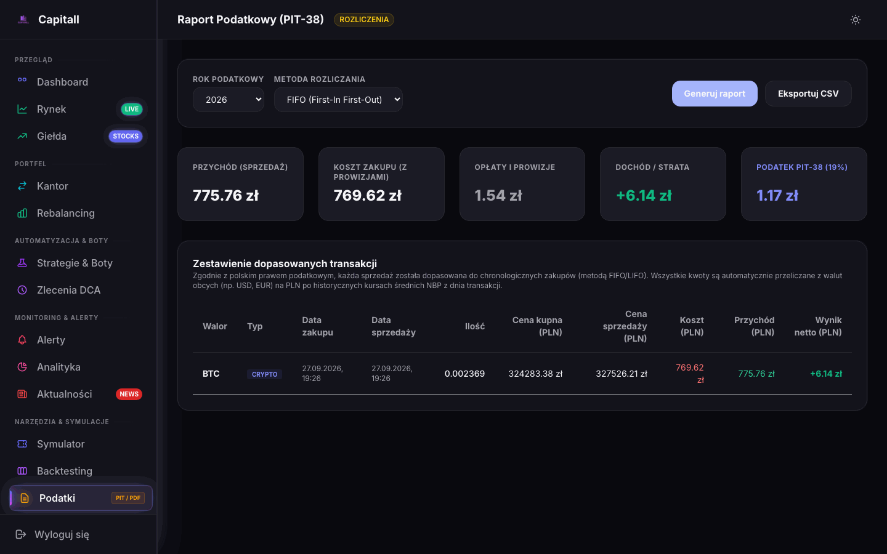

### Centrum pomocy

Wbudowana dokumentacja z opisem każdego modułu, filtrami kategorii, wyszukiwarką i FAQ.

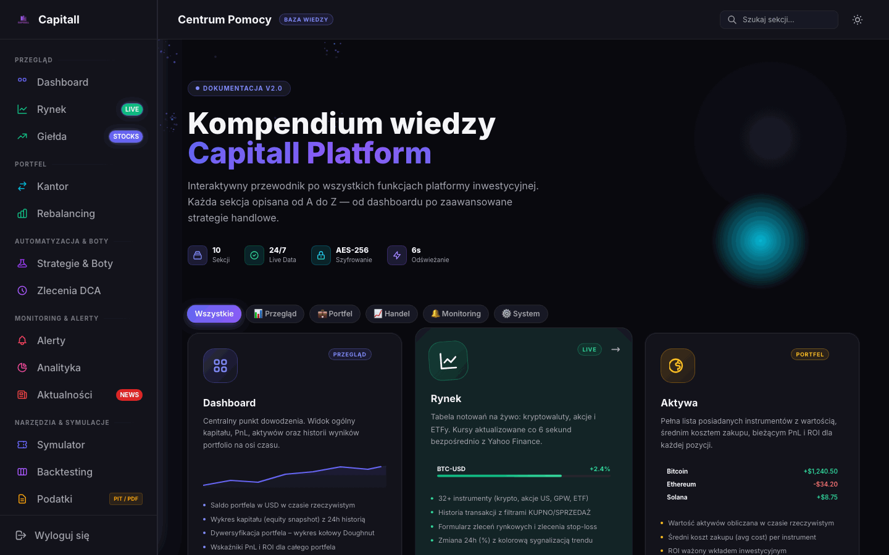

### Ustawienia konta

- Zmiana hasła
- **Prywatność portfela**: opcjonalne udostępnienie salda i historii innym użytkownikom
- Preferencje powiadomień (alert przy spadku kapitału, raport tygodniowy)
- **Eksport danych** do CSV: historia transakcji, snapshoty equity, historia alertów
- Status połączeń API z giełdami i test synchronizacji
- Dziennik aktywności (audit log) z adresami IP

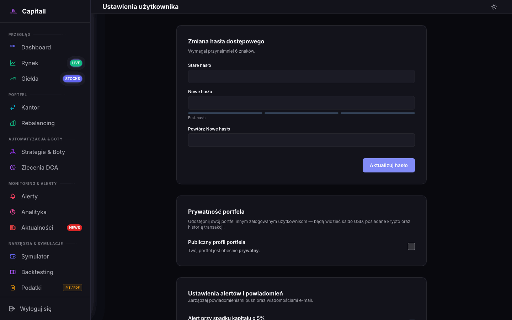

---

## Bezpieczeństwo

- **Aktywacja konta e-mailem + 2FA (TOTP)**: link aktywacyjny prowadzi do konfiguracji aplikacji uwierzytelniającej (kod QR); po jej włączeniu każde logowanie wymaga kodu jednorazowego
- **Polityka haseł**: minimum 12 znaków, wielkie i małe litery, cyfra i znak specjalny; hasła hashowane BCryptem
- **Ochrona przed brute force**: maks. 5 prób logowania na 5 minut z jednego adresu IP
- **Szyfrowanie kluczy API giełd**: AES-GCM-256
- **Nagłówki bezpieczeństwa**: CSP, HSTS, `X-Frame-Options: SAMEORIGIN`, Referrer-Policy; ochrona CSRF
- **Sesje**: ochrona przed session fixation, maks. 3 równoległe sesje
- **Audit log** operacji użytkownika

## Źródła danych

| Dane | Źródło |
|---|---|
| Ceny kryptowalut | Binance API |
| Notowania akcji i ETF, dane historyczne | Yahoo Finance |
| Kursy walut | NBP API |
| Fear & Greed Index | alternative.me |
| Dominacja BTC | CoinGecko |
| Wiadomości | Coinlore, kanały RSS |

---

## Uruchomienie

Wymagania: **Java 21** i **Maven 3.9+**.

```bash
mvn spring-boot:run
```

Aplikacja startuje pod adresem <http://localhost:8080>. Domyślnie używa plikowej bazy H2 w katalogu `data/`, tworzonej automatycznie przy pierwszym uruchomieniu.

### Konta demonstracyjne

Przy pierwszym starcie tworzone są konta testowe z rolą `USER`:

| Login | Hasło |
|---|---|
| `jankowalski` | `test123` |
| `pnowak` | `test123` |
| `mwisniewska` | `test123` |

### Testy

```bash
mvn test
```

## Konfiguracja

Wszystkie ustawienia można nadpisać zmiennymi środowiskowymi:

| Zmienna | Opis | Domyślnie |
|---|---|---|
| `SERVER_PORT` | Port HTTP | `8080` |
| `DB_URL` / `DB_DRIVER` | Adres i sterownik bazy (np. PostgreSQL) | H2 w `./data/capitalldb` |
| `DB_USERNAME` / `DB_PASSWORD` | Dane dostępowe do bazy | `sa` / puste |
| `CAPITALL_ENCRYPTION_KEY` | Klucz AES-256 do szyfrowania kluczy API (32 znaki) | wartość deweloperska, **zmień na produkcji** |
| `CAPITALL_DEFAULT_ADMIN_PASSWORD` | Hasło konta `admin` | generowane i wypisywane w logu |
| `MAIL_HOST` / `MAIL_PORT` / `MAIL_USERNAME` / `MAIL_PASSWORD` | Serwer SMTP (e-maile aktywacyjne) | `smtp.gmail.com:587` |
| `MAIL_FROM` | Adres nadawcy | `noreply@capitall.example` |
| `APP_BASE_URL` | Bazowy URL w linkach aktywacyjnych | `http://localhost:8080` |

Przykład z PostgreSQL:

```bash
DB_URL=jdbc:postgresql://localhost:5432/capitall \
DB_DRIVER=org.postgresql.Driver \
DB_USERNAME=capitall DB_PASSWORD=secret \
mvn spring-boot:run
```

## Architektura

```
src/main/java/com/capitall
├── config/        # Spring Security, inicjalizacja danych, tryb serwisowy
├── controller/    # Kontrolery MVC (widoki Thymeleaf) i REST API (/api/**)
├── dto/           # Obiekty transferowe
├── exception/     # Wyjątki domenowe i globalny handler
├── model/         # Encje JPA (User, Trade, Wallet, PriceAlert, RecurringOrder, TradingStrategy…)
├── repository/    # Repozytoria Spring Data
├── security/      # Rate limiting logowania, polityka haseł, obsługa 2FA
└── service/       # Logika biznesowa, harmonogramy (@Scheduled), klienci API giełd
src/main/resources
├── templates/     # Widoki Thymeleaf + fragmenty (head, nav, theme, footer)
└── static/        # Logo, skrypty JS
```

Zadania w tle (`@Scheduled`):

- odświeżanie danych rynkowych i AUM
- realizacja zleceń DCA (co 15 s)
- wykonywanie strategii botów
- snapshoty wartości portfela (co 5 min)
- pobieranie wiadomości
- wygaszanie przeterminowanych alokacji
